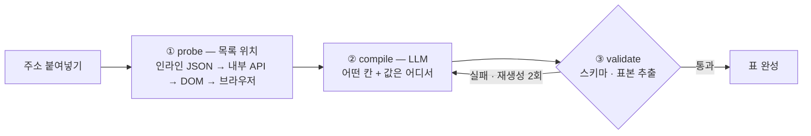
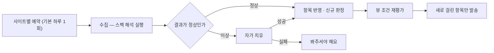
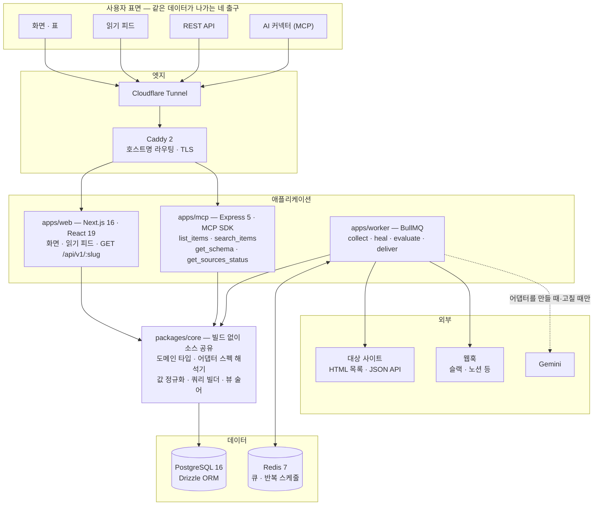
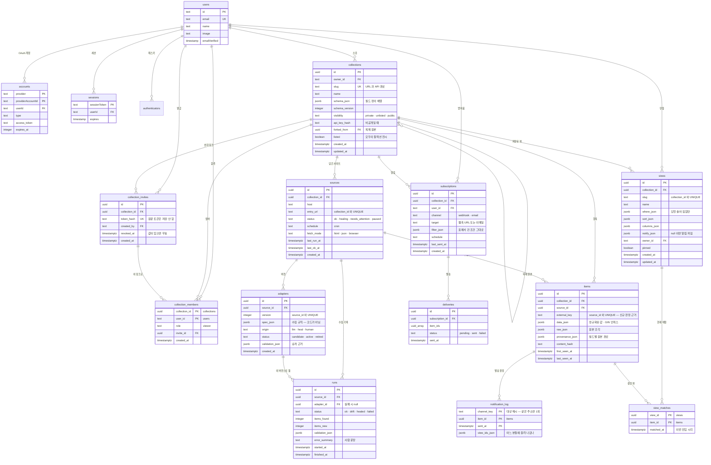

## 📖  프로젝트 소개

---

**Endpointer**는 사용자가 입력으로 넣는 URL 여러 개를 테이블, 피드, API, MCP 등으로 사용할 수 있도록 하는 **범용 스키마 생성 및 관리 서비스**입니다.

## 🤼  팀원 소개

---

**김희서**
SNU CSE 22

</aside>

<aside>
**박준서**
HYU CSE 22

</aside>

## 💭 기획 의도

---

### 정보는 공개돼 있는데, 왜 모으는 일은 늘 사람 몫일까요?

필요한 정보가 웹에 없어서 곤란한 경우는 드뭅니다.
곤란한 쪽은 그것이 열 곳에 흩어져 있고, 열 곳 모두 자기 화면 안에서만 검색과 정렬을 제공한다는 사실입니다.
”세 사이트를 통틀어 마감이 일주일 남은 것” 같은 조건은 어느 화면에도 존재하지 않습니다.

#### *for Non-developers*

— 그 조건을 대신하는 것이 결국 **사람**입니다.

매주 같은 페이지를 다시 열고, 본 것과 안 본 것을 기억해내고, 제각각인 날짜 표기를 머릿속에서 맞춥니다.
한 번으로 끝나면 수고에 그치지만, 이 일은 주기적으로 돌아옵니다.
정보는 무료인데, 접근하는 비용은 매주 청구됩니다.

#### *for Developers*

웹에 있는 정보 대부분에는 API가 없습니다.
그 정보를 자기 서비스에 쓰려면 수집기부터 정규화, 저장, 조회, 인증까지 전부 직접 만들어야 합니다.
만들려던 것은 그 데이터를 쓰는 기능이었는데, 데이터를 공급하는 인프라를 먼저 만들게 됩니다.

그렇게 세운 인프라는, 사이트가 클래스 이름 하나만 바꿔도 조용히 무너집니다.
빈 결과가 돌아오고, 로그에는 정상으로 남습니다.
사이트를 하나 더 붙이면 관리할 대상이 하나 더 늘어날 뿐, 문제가 줄지는 않습니다.

> 흩어진 것을 한 번 모으는 일이 아니라, 
모아둔 것이 계속 살아있고 필요한 곳에서 꺼내 쓸 수 있도록 하는 것.
**Endpointer**가 만들어진 이유입니다.
> 

## ✨ 주요 기능

---

🗒️ **여러 사이트, 하나의 스키마  |**  **사이트를 더해도 표가 하나입니다**

> 주소를 붙여놓고 잠시 기다리면 값이 이미 채워진 표가 나옵니다. 무엇을 어떻게 읽을지 미리 알려줄 필요가 없습니다.
사이트를 하나 더 붙여도 표가 새로 생기지 않고 같은 표에 섞여 들어오며,
사이트마다 다르던 날짜와 금액 표기도 같은 모양으로 맞춰집니다.
> 

♻️ **자가 복구  |  깨지면 스스로 고치고 보고합니다**

> 
> 
> 
> 지켜보던 사이트가 개편되면 보통은 표가 조용히 비어버립니다. 여기서는 그 사이트만 잠시 멈추고 나머지는 그대로 보입니다.
> 멈춘 동안에도 마지막으로 받아둔 내용은 계속 보이고, 다시 맞추는 데 성공하면 업데이트 여부를 화면에 보입니다.
> 

💾 **조건 저장/알림  |  한번 건 조건은 뷰로 저장됩니다**

> 표에서 한 번 거른 조건에 이름을 붙여두면, 다음부터는 그 이름만 눌러 같은 화면을 봅니다.
그 조건에 새로 걸리는 항목이 생기면 그때 알립니다. 물론 같은 항목을 두 번 보내지는 않습니다.
> 

🔍 **다중 출력  |  같은 표를 여러 방식으로 활용할 수 있습니다**

> 화면과 읽기 피드, 주소(REST API), AI 연결(MCP)이 모두 같은 내용을 냅니다.
저장한 뷰도 네 곳에 똑같이 적용되어, 화면에서 본 것과 API가 주는 것이 어긋나지 않습니다.
> 

## 📱 User Interface

---

<aside>

#### 환영합니다!

---

**Endpointer**에서는 Google OAuth를 통한 편리한 소셜 로그인을 지원합니다.

</aside>

<aside>

#### **튜토리얼**

---

**Endpointer**를 처음 접하는 사용자들이 서비스를 더 잘 이용할 수 있도록 튜토리얼을 제공합니다.
튜토리얼은 화면 좌측 하단 `다시보기`를 통해 재확인할 수 있습니다.

</aside>

<aside>

#### **컬렉션 생성하기**

---

**Endpointer**는 목록이 있는 페이지의 주소를 붙여넣는 것만으로 표를 만듭니다. 어떤 사이트를 봐야 할지 모를 때는 모으고 싶은 것을 말로 적어 후보를 찾을 수 있고, 여러 사이트를 담아 처음부터 하나의 테이블로 시작할 수도 있습니다.  

</aside>

<aside>

#### 컬렉션 테이블 조회하기

---

여러 사이트에서 모인 항목이 하나의 테이블로 합쳐집니다. 마감일·분류·출처로 조건을 걸 수 있고, 열 순서는 끌어서 바꿀 수 있으며, 걸어둔 조건은 그대로 저장할 수 있습니다.

</aside>

<aside>

#### 컬렉션 뷰 / 알림 관리

---

표에서 건 조건을 저장하면 하나의 **뷰**가 되고, 그 조건에 새로 걸리는 항목이 생기는 순간 웹훅으로 알려줍니다. 같은 항목을 두 번 보내지 않습니다.

</aside>

<aside>

#### 컬렉션 연결하기 🌟

---

동일한 컬렉션을 **주소(API)**와 **AI(MCP)** 양쪽으로 꺼내 쓸 수 있습니다. 주소 한 줄을 복사한 후 사용하는 AI의 커넥터 설정에 붙여넣으면 끝이고, 별도의 설치나 설정 파일은 없습니다.

</aside>

<aside>

#### 컬렉션 소스 관리/추가

---

**Endpointer**는 하나의 컬렉션에 여러 사이트를 붙여 같은 표로 관리합니다. 새 주소를 넣으면 기존 표의 열과 형식에 맞춰 자동으로 합쳐지고, 사이트마다 수집 상태는 사람이 읽는 문장으로 보여줍니다.

</aside>

<aside>

#### 모두의 컬렉션

---

다른 사람이 공개한 컬렉션을 둘러보고 복제해 내 것으로 가져올 수 있습니다. 복제본에는 원작자 크레딧이 남습니다.

</aside>

## 🌌  Implementation

---

<aside>

### 🗒️ 컬렉션 테이블 관리

</aside>

주소 하나로 표를 만들려면 다음 두 가지를 정해야 합니다. 

- **어떤 칸(열)을 둘지**,
- 그리고 **그 칸의 값을 어디서 읽을지**.

**Endpointer**는 이 둘을 사람에게 묻지 않고, LLM 이 만든 **JSON 스펙**으로 확정합니다. 선택자를 입력받는 칸은 화면에 존재하지 않습니다.

**① probe : 목록의 위치 찾기**

네 경로를 **싼 것부터 순서대로** 시도하고, 찾으면 거기서 멈춥니다. 인라인 JSON 은 0.5초, 브라우저 렌더는 3~5초가 걸리므로 이 순서가 곧 비용입니다. 후보마다 **화면에 보이는 텍스트와의 겹침률**을 계산해 점수를 매깁니다 — 메뉴나 광고가 아니라 "사람이 보고 있는 그 목록"인지 판정하는 근거입니다.

**② compile : LLM을 통해 스펙 만들기**

probe 가 찾은 후보와 샘플 몇 줄을 Gemini 에 주고, **어떤 칸을 둘지와 각 칸의 값 위치**를 JSON 으로 받습니다. LLM 이 내놓는 것은 코드가 아니라 선언이고, 실행은 `packages/core` 의 해석기가 합니다.

**③ validate : 관문 통과 후 저장** 

받은 JSON 은 zod 스키마로 검증하고, 실제로 표본을 추출해 항목이 나오는지 확인한 뒤에야 어댑터가 됩니다. 실패하면 **오류 문장을 그대로 프롬프트에 붙여 재생성**합니다.

#### **두 번째 사이트 붙이기 (소스 접합)**

이미 표가 있는 컬렉션에 새 주소를 붙이면, 위 흐름에 **한 단계가 더 붙습니다** — 새 사이트에서 찾은 값들을 **기존 표의 칸에 맞추는 것**(field matching). 새 칸을 만들지 않고 기존 스키마에 흡수시키므로, 사이트가 늘어도 표의 모양은 그대로입니다.

#### **안전 관문**

LLM 출력을 그대로 믿지 않기 위해 세 겹을 둡니다.

| **관문** | **막는 것** |
| --- | --- |
| **닫힌 연산자 집합** | 값 변환은 미리 정한 13개 연산자(`trim` · `date_parse` · `regex_extract` · `template` 등)로만 표현합니다. 자유 표현식이나 코드 문자열을 평가하는 길이 없으므로 샌드박스가 필요 없습니다 |
| **호스트 관문** | 스펙의 요청 주소가 사용자가 준 사이트를 가리키는지 검사합니다. 내부망 주소(localhost · 사설 IP · 클라우드 메타데이터)도 차단합니다 |
| **표기 교정** | LLM 이 반복하는 기계적 실수(선택자 접두사 누락 등)는 검증 **전에** 교정합니다. 의미가 하나로 확정되는 표기만 고치고, 결과는 같은 관문을 다시 통과합니다 |

#### **데이터 모델**

| **테이블** | **역할** |
| --- | --- |
| `collections` | 표 하나. **칸 정의(`schema_json`)를 여기에 둡니다** |
| `sources` | 붙어 있는 사이트. 컬렉션 하나에 여러 개 |
| `adapters` | 사이트별 수집 규칙(JSON 스펙). **버전이 쌓이고**, 활성은 하나입니다 |
| `items` | 수집된 항목. 값은 `data_json`(JSONB) 한 칸에 담고 GIN 인덱스로 필터합니다 |

항목을 컬렉션별 테이블로 쪼개지 않은 이유는 **사이트를 붙일 때마다 마이그레이션이 필요해지기 때문**입니다. 칸 구성이 사이트마다 다른데 테이블을 고정하면 접합 자체가 불가능해집니다.

<aside>

### 🗒️  컬렉션 테이블 업데이트

</aside>

#### **핵심 아이디어**

표는 한 번 만들면 **스스로 갱신됩니다.** 그리고 갱신 경로에는 **LLM 호출이 없습니다** — 저장된 스펙을 해석기가 그대로 실행할 뿐입니다. 사용자가 API 를 만 번 불러도 LLM 비용은 0입니다.

#### **갱신 흐름**

- **예약 — 사이트 단위**
    - 사이트마다 수집 주기를 따로 갖고, Redis 기반 큐에 **사이트당 예약 하나**를 등록합니다. 사이트를 붙이면 그 자리에서 예약이 생기고, 지우면 예약도 사라집니다. 시간대는 `Asia/Seoul` 로 고정합니다.
- **신규 판정 — 코드가 아니라 DB 제약으로**
    - "새 항목"의 기준은 `(사이트, 항목 고유키)` **UNIQUE 제약**입니다. 같은 키가 이미 있으면 갱신, 없으면 신규입니다. 판정을 로직이 아니라 제약에 맡기므로 잡이 두 번 돌아도 같은 항목이 두 번 세어지지 않습니다.
        
        값이 바뀐 항목은 따로 구분합니다. **정규화된 값만으로 지문(해시)을 만들어** 비교하기 때문에, 원문의 공백이나 태그가 바뀌어도 알림이 울리지 않습니다.
        
- **자가 치유 — 깨진 것을 감지·격리·재컴파일·승격**
    - 수집 결과를 **직전 성공 기록들과 비교**해 이상을 판정합니다. 항목 수가 절반 이하로 줄었거나, 특정 칸이 갑자기 비기 시작했거나, 타입 검증 실패가 늘었으면 드리프트입니다.
        
        드리프트가 잡히면 사이트를 `다시 맞추는 중` 으로 바꾸고 치유를 예약합니다. 치유는 새 스펙을 만들어 보고 **관문을 두 겹** 통과해야 승격됩니다 —
        
        1. 검증 통과 (표본에서 항목이 나오고 칸이 채워지는가)
        2. **직전 성공 결과와 겹침률 30% 이상** (엉뚱한 목록을 잡아온 게 아닌가)
        
        둘 다 통과하면 새 어댑터 버전이 활성이 되고 사이트가 정상으로 돌아옵니다. 실패하면 `봐주셔야 해요` 로 남고, 그동안 화면에는 **마지막으로 받아둔 내용**을 계속 보여줍니다. 성공한 치유는 지워지지 않고 쌓여서 화면의 `이번 달 자동 복구 N회` 가 됩니다.
        
- **뷰 재평가와 알림**
    - 갱신이 끝나면 저장된 뷰의 조건을 다시 재봅니다. 뷰별로 **현재 매칭 집합**을 두고, 이번에 매칭된 것과의 차집합이 곧 "새로 걸린 항목"입니다. 조건을 벗어나면 집합에서 빠지고, 다시 들어오면 새 사건으로 셉니다.
        
        발송은 **주소별 원장**으로 중복을 막습니다. 같은 (받는 주소, 항목) 조합은 24시간 안에 다시 보내지 않으므로, 잡이 재시도되거나 여러 뷰에 동시에 걸려도 한 번만 갑니다.
        

#### **부분 성공이 정상입니다**

사이트 하나가 깨져도 나머지는 그대로 응답합니다. API 응답에는 항목과 함께 **사이트별 상태**가 늘 실려 나가므로, 받는 쪽이 "지금 세 곳 중 두 곳만 최신"이라는 사실을 알 수 있습니다.

#### **시간축은 지우지 않습니다**

수집 기록과 항목 스냅샷을 삭제하지 않습니다. 복구 이력을 쌓아 보여주는 것까지가 기능이고, "언제부터 이 사이트가 조용한가" 같은 판단도 이 기록에서 나옵니다.

## ⚙️ Tech Stack

---

| 기술 | 용도 |
| --- | --- |
| **TypeScript** | 앱 3개 (web/worker/mcp)가 공유 코어 하나를 소스째 씀 |
| **Next.js / React** | 화면 + GET /api/v1/{slug}를 한 앱이 냄 |
| **PostgreSQL** | 화면을 JSONB 한 칸  + GIN 인덱스로 |
| **Redis** | 사이트별 정기 수집 예약 |
| **Gemini (@google/genai)** | 수집 규칙 생성 및 치유 전용. 런타임 경로에는 호출하지 않음 |
| **MCP SDK** | AI 커넥터 출구 |
| **Playwright** | 스크립트로 그리는 목록을 여는 마지막 수집 경로 |

## 💻  System Architecture

---

#### 💡 Key Points

- **LLM은 컴파일 경계 안에만 존재합니다.**
    - Gemini는 수집 규칙을 만들거나 고칠 때만 부르고, 정기 수집 · REST 응답 · AI 도구 실행 경로에는 호출이 없습니다. 그래서 응답이 빠르고, 비용이 트래픽에 비례하지 않고, 같은 입력에 같은 출력이 나타납니다.
- **수집 규칙은 실행되는 코드가 아니라 JSON 선언입니다.**
    - LLM 이 내놓는 것은 미리 정한 연산자 집합으로만 쓰인 스펙이고, 그것을 읽는 해석기는 `packages/core` 에 하나뿐입니다. 실행할 코드가 없으니 샌드박스도 필요하지 않습니다.
- **네 출구가 같은 코어를 탑니다.**
    - 화면 · 읽기 피드 · REST · AI 가 같은 쿼리 빌더와 조건 술어를 쓰므로, 표에서 건 조건이 그대로 API 쿼리이자 AI 도구의 인자입니다. 네 곳을 따로 구현하지 않았으니 서로 어긋날 자리가 없습니다.

## 💾  DB Schema

---

